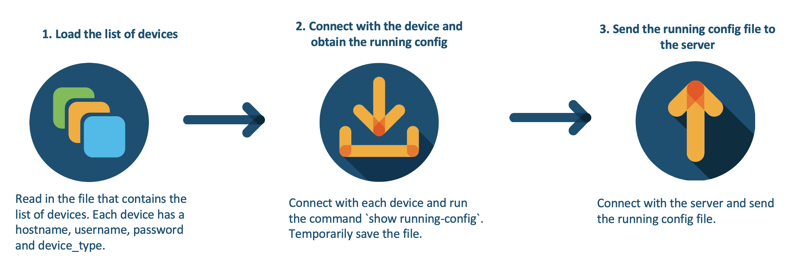

# GVE DevNet Backup Config Script
For many users and service providers, it is important to make regular back-ups of your configuration files, so you can easily revert back to a working state. Cisco IOS-XE is an open and flexible operating system. In this Proof of Value (PoV), we take a three step approach to back-up our running configs and send the back-up to a server:

1. First, we read in a list of devices, which is a yaml file. In the list of devices, each device has a `hostname`, `username`, `password` and `device_type`. In this repository, we have uploaded a few Always-On DevNet Sandboxes. 

> For more information on the DevNet Sandboxes, click [here](https://devnetsandbox.cisco.com)

2. Next, we loop through the list of devices and for each device, we make a connection and we run the command `show running-config` to obtain the running coniguration. After obtaining the running configuration, we save it temporarily. 

3. Last, we send the running configuration to a server using an `scp` command. We repeat the process for each device in the list of devices. 



## Contacts
* Simon Fang (sifang@cisco.com)

## Solution Components
* Python 3
* Netmiko
* SSH
* IOS-XE
* CentOS server


## Installation/Configuration

The following commands are executed in the terminal.

1. Create and activate a virtual environment for the project:
   
        #WINDOWS:
        $ py -3 -m venv [add_name_of_virtual_environment_here] 
        $ [add_name_of_virtual_environment_here]/Scripts/activate.bat
        #MAC:
        $ python3 -m venv [add_name_of_virtual_environment_here] 
        $ source [add_name_of_virtual_environment_here]/bin/activate
        
> For more information about virtual environments, please click [here](https://docs.python.org/3/tutorial/venv.html)

2. Access the created virtual environment folder

        $ cd [add_name_of_virtual_environment_here]

3. Clone this repository

        $ git clone [add_link_to_repository_here]

4. Access the folder `gve_devnet_backup_config_script`

        $ cd gve_devnet_backup_config_script

5. Install the dependencies:

        $ pip install -r requirements.txt

6. Open the `.env` file and add the environment variables. Please note that all the variables below are strings.

    ```python
    SERVER_USERNAME = '<insert_server_username>' # e.g. 'admin'
    SERVER_HOST = '<insert_server_host>' # e.g. '10.10.10.10'
    DST_FOLDER = '<insert_dst_folder>' # e.g. '/path/to/file/'
    DEVICE_PASSWORD = 'C1sco12345' # Note: this is just an example password
    ```

    The first three variables relate to the server, but the last variable refers to the password of the devices that we are logging into. We are assuming that each device has the same password, but this might be different in your production environment. Please change this accordingly. 

7. Add your devices to the `devices.yaml` file, which has the following format under the key `devices`:

* `host`
* `username`
* `password`
* `device_type`

    An example `devices.yaml` is added to the repository. These devices are part of the Always-On DevNet Ssandboxes. Please note: the password in the `devices.yaml` are masked and loaded in as an environment variable. 


## Usage

Now it is time to run the script. Simply type the following command in your terminal:


    $ python main.py


# Screenshots


### LICENSE

Provided under Cisco Sample Code License, for details see [LICENSE](LICENSE.md)

### CODE_OF_CONDUCT

Our code of conduct is available [here](CODE_OF_CONDUCT.md)

### CONTRIBUTING

See our contributing guidelines [here](CONTRIBUTING.md)

#### DISCLAIMER:
<b>Please note:</b> This script is meant for demo purposes only. All tools/ scripts in this repo are released for use "AS IS" without any warranties of any kind, including, but not limited to their installation, use, or performance. Any use of these scripts and tools is at your own risk. There is no guarantee that they have been through thorough testing in a comparable environment and we are not responsible for any damage or data loss incurred with their use.
You are responsible for reviewing and testing any scripts you run thoroughly before use in any non-testing environment.
